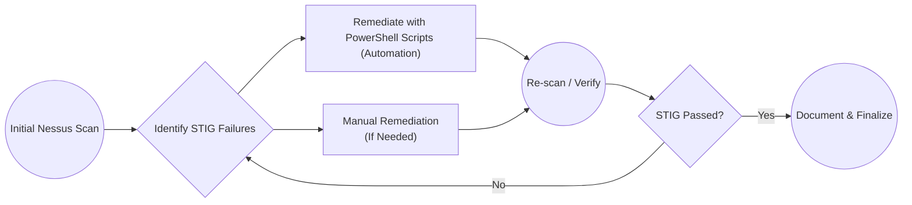

# Windows 11 STIG Remediation Repository

Welcome to my **Windows 11 STIG v3r2** remediation project! This repository documents how I systematically remediated STIG findings from an initial Tenable Nessus STIG scan on a Windows 10 Azure VM.

## Table of Contents

1. [Project Overview](#project-overview)
2. [High-Priority STIG Controls](#high-priority-stig-controls)
3. [Remediation Workflow](#remediation-workflow)
4. [Scripts Folder](#scripts-folder)
5. [Sub-Pages / Documentation](#sub-pages--documentation)
6. [Initial Nessus Scan Results](#initial-nessus-scan-results)

---

## Project Overview

- **Purpose**: Demonstrate the practical process of scanning a Windows 10 Azure VM with Nessus, identifying STIG findings, remediating them with PowerShell or manual configuration, and verifying the result.
- **Scope**: Focus on the DISA Windows 10 STIG v3r2 controls.

## High-Priority STIG Controls

This table briefly lists my top priority controls (based on severity, exploitability, and minimal user disruption). Each links to a more detailed page in the `docs/` folder.

| STIG ID(s)                      | Summary                                                 | Link                                                         |
|---------------------------------|---------------------------------------------------------|--------------------------------------------------------------|
| WN10-AU-000500 / -000505 / -000510  | Increase event log sizes to meet STIG thresholds        | *[Event Log Sizes](./docs/STIG-EventLogSizes.md)*             |
| WN10-00-000155                  | Disable Windows PowerShell 2.0                          | *[Disable PS2](./docs/STIG-DisablePS2.md)*                                       |
| WN10-AC-000005 / -000010 / -000015 | Enforce account lockout policy (3 attempts, 15 min lock) | *[Account Lockout](./docs/STIG-AccountLockout.md)*                                    |
| WN10-AC-000035 / -000040        | Require 14+ character passwords and enable complexity      | *[Password Complexity](./docs/STIG-PasswordComplexityRemediation.md)*                                       |
| WN10-CC-000180 / -000185 / -000190 | Disable AutoPlay/AutoRun for all drives               | *[Disable AutoPlay](./docs/STIG-DisableAutoPlay.md)*                                       |
| WN10-00-000145                  | Enable Data Execution Prevention (DEP) in “OptOut” mode | *[Configure DEP](./docs/STIG-ConfigureDEP.md)*                                       |
| WN10-CC-000038                  | Disable WDigest authentication                          | *[Disable WDigest](./docs/STIG-DisableWDigest.md)*                                       |
| WN10-00-000175                  | Disable Secondary Logon Service                         | *[Disable Secondary Logon](./docs/STIG-DisableSecondaryLogon.md)*                |

## Remediation Workflow

Below is the general workflow I use:

1. **Scan** the system with Tenable Nessus STIG policy.
2. **Identify** failed STIG items.
3. **Remediate** using PowerShell scripts or manual steps.
4. **Verify** success by rescanning.

## Scripts Folder

All PowerShell scripts are stored under [`scripts/`](./scripts). Each script references the relevant STIG ID(s) and includes usage instructions:

1. **[Set-STIG-EventLogSizes-GPO.ps1](./scripts/Set-STIG-EventLogSizes-GPO.ps1)**  
   - Automates **WN10-AU-000500**, **-000505**, **-000510** to ensure event log sizes meet STIG thresholds.

2. **[Disable-PowerShell2.ps1](./scripts/Disable-PowerShell2.ps1)**  
   - Remediates **WN10-00-000155** by removing the legacy PowerShell 2.0 feature, preventing downgrade attacks and enabling advanced logging in modern PowerShell versions.

3. **[Disable-WDigest.ps1](./scripts/Disable-WDigest.ps1)**  
   - Addresses **WN10-CC-000038** by setting `UseLogonCredential=0` to prevent plaintext password storage in LSASS for WDigest authentication.

4. **[Disable-AutoPlay.ps1](./scripts/Disable-AutoPlay.ps1)**  
   - Remediates **WN10-CC-000180**, **-000185**, **-000190** by disabling AutoPlay/AutoRun for all drives and devices, preventing autorun commands from executing.

5. **[Set-STIG-AccountLockout.ps1](./scripts/Set-STIG-AccountLockout.ps1)**  
   - Enforces **WN10-AC-000005**, **-000010**, **-000015** by setting account lockout threshold (3 attempts), lockout duration (15 minutes), and reset counter (15 minutes).

6. **[Set-STIG-PasswordComplexity.ps1](./scripts/Set-STIG-PasswordComplexity.ps1)**  
   - Configures **WN10-AC-000035**, **-000040** to require passwords of ≥14 characters and enable password complexity rules.

7. **[Disable-SecondaryLogon.ps1](./scripts/Disable-SecondaryLogon.ps1)**  
   - Implements **WN10-00-000175** by stopping and disabling the Secondary Logon service (seclogon), preventing privilege escalation scenarios.

8. **[Set-DEP-OptOut.ps1](./scripts/Set-DEP-OptOut.ps1)**  
   - Fulfills **WN10-00-000145** by setting Data Execution Prevention (DEP) to OptOut (or higher) using `bcdedit`.

## Sub-Pages / Documentation

For detailed breakdowns of each STIG item, see the [`docs/`](./docs) folder. Each page includes:
- The problem statement/vulnerability,
- Manual vs. automated remediation steps,
- Testing/verification screenshots,
- Rollback instructions (if needed).

### Example Sub-Page

- [Event Log Sizes (WN10-AU-000500, -000505, -000510)](./docs/STIG-EventLogSizes.md)

## Initial Nessus Scan Results

Below is a snippet or screenshot of my baseline Nessus scan showing various failures:

## Initial STIG Scan
For the original Nessus scan results (showing the baseline STIG failures), see:
[Baseline-STIG-Scan.pdf](./reports/Baseline-STIG-Scan.pdf)

---

## Final Results

After applying all STIG remediations, I re-ran my Nessus scan. Initially, there were **137** failed checks, and now there are **122**, resulting in **15** items resolved.

This screenshot shows the updated scan results:

*Figure: Nessus scan indicating 122 remaining items.*

---

## Post-Remediation Testing

After each STIG remediation, it is important to perform basic operational checks:
- Verify event logs for errors or warnings.
- Test critical applications and workflows to ensure no disruptions.
- Monitor for any unexpected system behavior or compatibility issues.
- If a service or feature fails, consider temporarily rolling back that specific STIG setting or create an exception per organizational policy.

## Ongoing Vulnerability Management (Maintenance Mode)

With the major vulnerabilities addressed, I will continue scanning regularly, applying patches, and reviewing STIG updates. This approach ensures new risks are caught early and the environment remains secure over time.

---

*Thank you for visiting! I hope this project helps illustrate how to methodically address STIG findings.*
